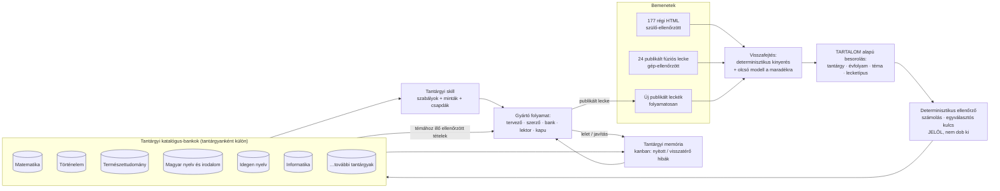
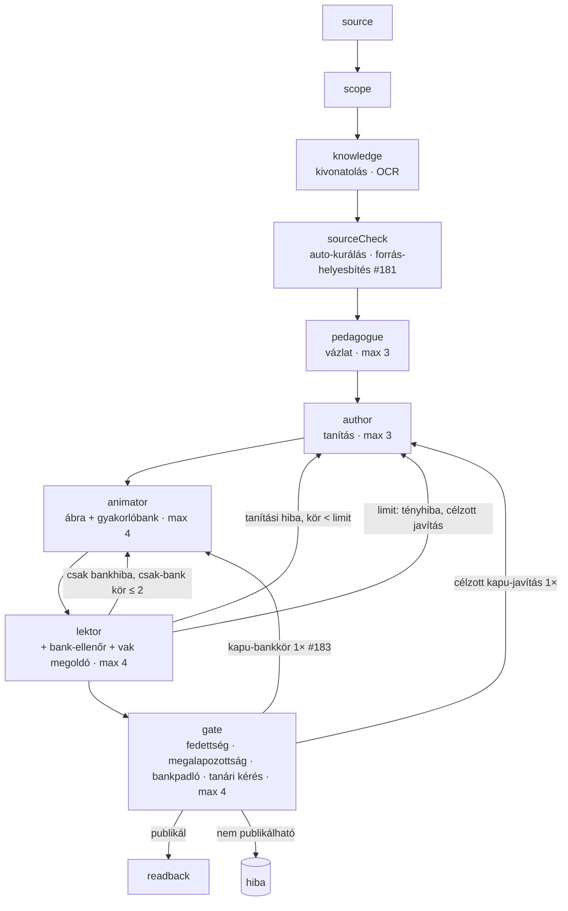
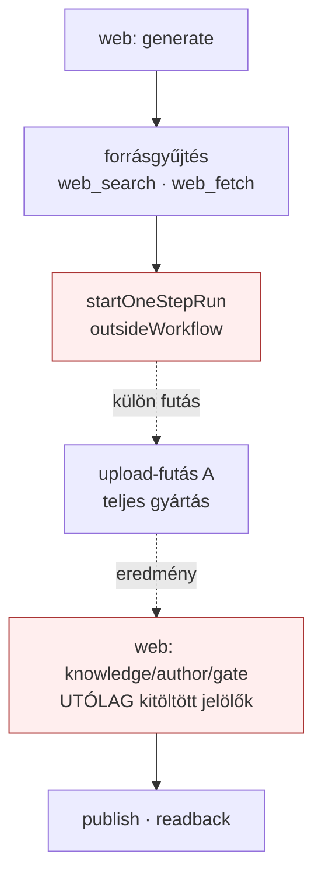
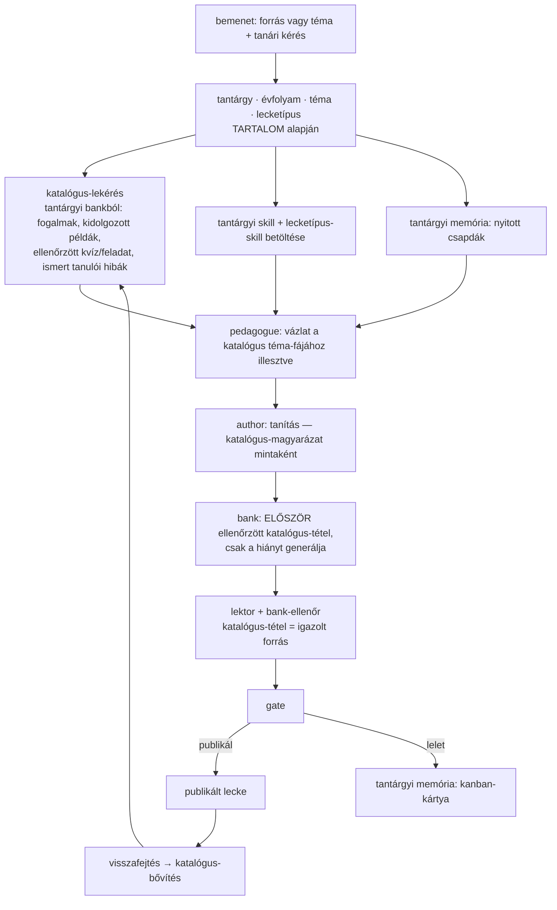

# Tantárgyi tudásbank, munkafolyamat-rendbetétel és tanult skillek — TERV (2026-10-05)

Tulajdonosi kérés (2026-10-05): minden munkafázisnak legyen tűpontos munkafolyamata és folyamatábrája; a munkafolyamatokból
skillek; az ÖSSZES eddigi tananyag (a régi, szülők által kézzel ellenőrzött HTML-leckék is) visszafejtése, TARTALOM alapján
tantárgyba és lecketípusba sorolva, tantárgyanként külön katalógus-bankba; tantárgyi skill + tantárgyi memória (kanban);
elemzés: mennyit javít ez a WEBSULI szabályszerű, hibátlan működésén. Ez a dokumentum a TERV (1. fázis) — kód nincs benne.

---

## 1. Mért kiinduló állapot (éles DB + kód, 2026-10-05)

### 1.1 Tananyag-korpusz
| Forrás | Darab | Tartalom | Megbízhatóság |
|---|---|---|---|
| Régi HTML-leckék (`html_files.content_type='html'`) | 177 | ~1,4 MB magyarázó szöveg, ~3600 fejezetcím, ~15 000 kvízkérdés-objektum (szkriptből becsülve), 99 lecke ≥5 kvízzel + helyes válasszal, 32 lecke kulcsszavas nyílt feladattal, 18 szinte üres | **szülők által kézzel ellenőrzött (~99%)** |
| Publikált fúziós leckék (`lessons.published_at`) | 24 | 1966 kvíz, 1122 nyílt feladat, 519 módszer; 228 fejezet; Történelem 10, Matematika 9, Természetismeret 5 | gépi kapun + bank-ellenőrön átment |
| Nem publikált fúziós vázlatok | 45 | félkész, gyakran bukott futás | NEM forrás |

Tantárgy a régi anyagban **cím alapján** (csak becslés; 52 cím besorolhatatlan → ezért kell a TARTALOM alapú besorolás):
Matematika ~38, Angol/idegen nyelv ~31, Természettudomány ~25, Magyar ~15, Történelem ~9, Informatika ~6, egyéb (irodalom,
földrajz, ének, hittan, kompetenciamérés) a besorolhatatlanok között.

### 1.2 Futások eredményessége
- Kanonikus mérés (S0, `docs/measurements/2026-10-05-baseline.json`, csak a LEZÁRT futások): **75 futás → 23 sikeres (31%)**,
  52 bukott. Matematika 8/31 (26%), Természetismeret 5/18 (28%), Történelem 9/16 (56%), magyar 0/4, környezetismeret 0/3.
  Heti trend (minden job, 2 nem lezárttal): 1/9 → 0/6 → 7/26 → 5/12 → 10/24 (javul, de messze nem szabályszerű).
- A bukások oka (52, S0-osztályozó): bank-csomag 12, infrastruktúra 9, bank-padló kivétel után 6, tényhiba a limiten 6,
  séma/kódhiba 6, fedettség/megalapozottság 5 (a #184/#186 előtt ennek nagy része hamis lelet volt), egyéb 5, animátor-szerződés 1,
  keret 1, forrás 1.
- Lektori jegyzetek (896): **a hibák zöme a gyakorlóbankban van** — Matematika 538/572, Történelem 237/250 bank-tétel; a tanítás
  (explain/example) jegyzetei kevesek. A tanult hibaminták közül a legnagyobb az osztályozatlan „unknown/animator” (114).
- **Témaátfedés (durva, kulcsszavas jelzőszám, minden jobra):** a 77 jobból 52-höz, a 52 bukottból 39-hez már létezett témaközeli lecke a katalógusban
  (±1 évfolyam, közös tartalmi szó) — a tudás nagyrészt MEGVOLT, a rendszer nem használta.
- **Tanulói eredményesség NEM mérhető:** `lesson_attempts` = 4, `concept_results` = 0. A „lecke eredményessége” ma csak gyártási
  minőséggel (kapu, lektor, bank-ellenőr, szülői ellenőrzés) mérhető; a tanulói mérés bekötése külön szelet (8. pont).

### 1.3 Munkafolyamatok — mi van workflow alatt és mi nincs (fájl:sor a felderítésből)
| # | Útvonal | Workflow-mód | Skill | Tanulás |
|---|---|---|---|---|
| A | Feltöltés egy lépésben (`lesson-pipeline-routes.ts:236`) | upload: source→scope→knowledge→sourceCheck→pedagogue→author→animator→lektor→gate→readback | van | van |
| B | Térképről (`:781`) | studio | van | van |
| B′ | Folytatás workflow-előzmény nélkül (`:736-742`) | **NINCS** | van | **nincs** |
| C | Webes kutatás (`web-research-routes.ts:26`) | web — de a valódi gyártás egy KÜLÖN upload-futás (`web-studio-handoff.ts:86`, `outsideWorkflow`); a web-futás lépései utólag „kitöltve” (`web-research-jobs.ts:105-107`) | van | **gyenge** (nincs workflowFinding) |
| D | Strukturált javítás (`improveAsync.ts:553` → repair) | repair | van | van |
| E | Régi HTML-javítás (improveAsync, html) | html | van | részleges |
| F | Fogalom-javítás (`:915`) | concept | van | van |
| G | Jelölt alkalmazása (`workflows/apply.ts:12`) | apply | — (determinisztikus) | — |
| H | Régi HTML-útvonalak (`routes.ts:1188-1633`: responsive/errors/theme/chat/apply) | **NINCS** | csak szöveg | **nincs** |
| I | Anyagkészítő chat / elemzés (`routes.ts:1667-2344`) | **NINCS** | csak szöveg | **nincs** |
| J | Játék-kvízgenerátor (`routes.ts:1023`) | **NINCS** | csak szöveg | **nincs** |
| K | Térkép-kivonatolás / újraellenőrzés (`studio/routes.ts:210, :350`) | **NINCS** (csak preparation-skill) | van | **elvész** |

Szerep-szintű hiányok: OCR runbook/tanult szabály nélkül (`ocr.ts:281`); topic-focus skill-szöveg nélkül; gate-helper,
quiz-polish, figure-check deklarált szerep hívóhely és skill nélkül; a támogató szerepek (scope, corrector, verifier, vak
megoldó, instruction-*) csak hibán át tanulnak.

**Tudás-újrahasznosítás ma:** csak PONTOS egyezés (`inputHash` → ugyanaz a térkép / ugyanaz a publikált lecke). Tantárgyi
tudás, tantárgyi skill, tantárgyi memória **nincs**; a tanulás tulajdonosonként × 2 skill (`tananyag-keszito`, `-javito`) ×
15 rögzített szabály (`shared/lesson-skill.ts:13`), tantárgy-dimenzió nélkül. A leckének nincs forrás-típus mezője.

---

## 2. A válasz a fő kérdésre: mennyit javít a tantárgyi tudásbank + tantárgyi skill?

**Mechanizmus szerint (mért hibákra vetítve):**
1. **Gyakorlóbank (a legnagyobb hibaforrás).** Ma minden lecke bankját a modell a semmiből írja, és a hibák ~94%-a (Matek
   538/572) itt keletkezik. A tantárgyi katalógus-bank ellenőrzött tételeket ad (szülői ~15 000 kvíz + 1966 gépi ellenőrzött
   kvíz, 1122 feladat, 519 módszer). Ha a bank-gyártó a témához illő, ELLENŐRZÖTT tételből indul (átvétel / igazítás a
   lecke fogalmaihoz) ahelyett, hogy újat találna ki, a bank-hibák és a bank-javító körök száma a fedett témákon várhatóan
   **többszörösen csökken** — ez becslés, a 6. pont A/B-visszajátszása méri.
2. **Tantárgyi skill (ismétlődő hibaosztályok).** A javított hibák zöme tantárgy-specifikus volt: matek — előjel, képlet,
   zárójel, típusos válasz (#181–#186); történelem — évszám, név, forrás-hűség; természettudomány — mértékegység, folyamat-
   sorrend; nyelvek — kiejtés/TTS, nyelvtani forma. Ma ezek egy közös promptban/heurisztikában ütköznek; tantárgyi skillel a
   szabály ott él, ahol érvényes, és a tantárgyon kívül nem zavar.
3. **Tantárgyi memória (kanban).** A nyitott/visszatérő hibák tantárgyanként láthatók és lezárhatók; a következő futás a
   tantárgy ismert csapdáit előre kapja (ma a tanult szabály tantárgyfüggetlen és csak 15 rögzített kódból választ).
4. **Munkafolyamat-rendbetétel.** A workflow nélküli útvonalak (H, I, J, K, B′) és a kettévágott webes út (C) ma kívül esnek
   a kereten, a tanuláson és a mérésen — itt a hiba nem is látszik. Workflow alá kerülve ugyanaz a kapu/tanulás védi őket.

**Várható hatás (becslés, mérendő):** a bukások ~75%-a (39/52) olyan témán történt, amelyhez volt katalógus-anyag; a bukások
legnagyobb osztálya a bank. Reális cél az első fázis után: a futás-sikeresség **31% → 70–85%** a katalógus által fedett
témákon, a bank-javító körök és a lektori bank-jegyzetek **legalább felére** csökkenése. Nem fedett témán (új tananyag) a
hatás kisebb (csak a tantárgyi skill és memória). A számok **nem ígéretek**: a 6. pont mérési protokollja dönti el.

**Kockázatok:** (a) téma-tévesztés (rossz katalógus-tétel kerül a leckébe) → kötelező fogalom-/évfolyam-illesztés és
lektor-jelölés; (b) a régi anyag ~1% hibája → determinisztikus ellenőrző (számolás, egyválasztós kulcs, #181/#186 modulok)
JELÖL, nem dob ki; (c) a katalógusból átvett tétel a forrás-hűség szabályával ütközhet → a tétel forrása (provenance) mindig
tárolva, a lektor a katalógus-tételt saját forrásként fogadja el; (d) költség → determinisztikus kinyerés elsőként.

---

## 3. Célarchitektúra

### 3.1 Katalógus-tétel (adatmodell, tervezet)
`subject_catalog_items`: `subject`, `grade`, `topic` (normalizált téma-azonosító), `lesson_type`, `kind`
(`concept | explanation | worked_example | quiz | open_task | method | student_error`), `content` (strukturált JSON:
kérdés, opciók, helyes kulcs, magyarázat, minta, típusos válasz), `provenance` (`legacy_html:<id>` / `lesson:<id>` /
`map:<id>`), `trust` (`parent_verified` / `pipeline_verified` / `flagged`), `checks` (determinisztikus ellenőrzés
eredménye), `fingerprint` (duplikátum-szűrés), `uses` / `outcome` (későbbi tanulói mérés).
`subject_topics`: tantárgyanként a téma-fa (évfolyam → témakör → téma), a katalógusból felépítve, a NAT/kerettanterv
szerkezetéhez illesztve.

### 3.2 Lecketípusok (visszafejtésből, első közelítés — a katalogizálás véglegesíti)
| Típus | Jellemző (régi korpusz) | Saját folyamat / skill |
|---|---|---|
| Fogalom-tanító tartalomlecke | fejezetek + magyarázat + kvíz (Természettudomány, Történelem) | tartalom-skill + fedettség |
| Gyakorló feladatlap | sok feladat, kevés magyarázat (Matek) | képlet-/típusos-válasz skill, kidolgozott példák |
| Szókincs-/kifejezés-lecke | nagyon sok rövid kvíz, kevés szöveg (Angol: 200–400 kvíz/lecke) | TTS, kiejtés, nyelvtani forma skill |
| Irodalmi mű / szövegértés | hosszú szöveg, értelmező kérdések (Magyar) | szövegértés-skill, idézet-hűség |
| Témazáró / felkészítő | vegyes, sok témakör | téma-lefedettség, keverés |
| Tanulói munka javítása | hibás megoldások a forrásban | negatív-példa skill (#181) |

---

## 4. Tűpontos folyamatábrák

### 4.1 Mai feltöltéses útvonal (A) — a kapuk és a javítókörök

### 4.2 Mai webes útvonal (C) — a kettévágás (javítandó)

### 4.3 Célállapot: gyártás tantárgyi tudásbankkal

---

## 5. Megvalósítási szeletek (mindegyik: terv → végrehajtási utasítás → kód → mérés; ~400 sor/PR)

| Szelet | Tartalom | Költség | Elfogadás (EARS, röviden) |
|---|---|---|---|
| **S0 Mérési alap** | A/B-visszajátszó keret a rögzített futásokra (bank-hibák/lecke, csak-bank körök, kapu-első-átmenet, sikeresség) | 0 modell | a mai 75 lezárt futásra reprodukálható alapszámok (kanonikus: `docs/measurements/2026-10-05-baseline.json`) |
| **S1 Katalógus-gyűjtés** | mind a 201 lecke (177 régi + 24 fúziós) DETERMINISZTIKUS kinyerése: fejezetek, magyarázó szöveg, kvíz (kérdés/opciók/kulcs), feladat (kulcsszó/minta), módszer | 0 modell | ≥95% kvíz helyes kulccsal kinyerve; kézi mintavétel 20 leckén |
| **S2 Tartalom alapú besorolás** | tantárgy · évfolyam · téma · lecketípus TARTALOMBÓL (olcsó modell + determinisztikus jelek), tantárgyanként KÜLÖN bank | ~177 olcsó hívás (pilot 10 leckén méri a pontos tokenszámot) | a 52 cím szerint besorolhatatlan lecke is besorolva; kézi ellenőrzés: ≥95% egyezés |
| **S3 Ellenőrző + bizalmi szint** | #181/#186 determinisztikus ellenőrző a katalógus-tételekre; `parent_verified` / `pipeline_verified` / `flagged` | 0 modell | a jelölt tételek listája a szülőnek átnézésre |
| **S4 Tantárgyi skillek** | tantárgyanként skill-fájl: (a) a katalógus mintáiból (jó magyarázat-/feladatminták), (b) a 896 lektori jegyzet + tanult hibaminták tantárgyi csoportjaiból (csapdák), (c) lecketípus-skillek | 0–kevés modell | minden tantárgyhoz és lecketípushoz verziózott skill, forrás-hivatkozással |
| **S5 Tantárgyi memória (kanban)** | `subject_memory` tábla: kártya = visszatérő hibaosztály / nyitott csapda (tantárgy, lépés, kód, előfordulás, státusz); a tanulási hurok (`lesson_skill_lessons`) tantárgy-dimenzióval | 0 modell | a futás a tantárgy nyitott kártyáit promptban kapja; admin-nézet |
| **S6 Bekötés a gyártásba** | lekérés a tervezőnek/szerzőnek; a bank-gyártó ELŐSZÖR katalógus-tételt igazít, csak a hiányt generálja; a lektor a katalógus-tételt igazolt forrásként kezeli | futásonként kevesebb token | A/B: a fedett témákon a bank-hibák és a bank-körök ≥50%-kal csökkennek; sikeresség mérve |
| **S7 Workflow-rendbetétel** | H, I, J, K, B′ workflow alá; a webes út (C) egy futásban; OCR/topic-focus skill; a támogató szerepek saját lelet-kódjai | 0 modell | nincs lecke-módosító útvonal workflow nélkül (forrás-ellenőrző teszt) |
| **S8 Tanulói eredményesség** | a `lesson_attempts`/`concept_results` bekötése a leckelejátszóba → tételenkénti eredmény visszaírása a katalógusba (`outcome`) | 0 modell | tételenkénti helyes-arány a katalógusban |
| **S9 Prompt-javító orkesztrátor** (tulajdonosi tervezés 2026-10-05) | hibánál a DeepSeek v4.1 flash ELEMZI a bukott szakaszt (prompt, kimenet, kapu-leletek, forrás), és JAVÍTÓ PROMPTOT ír a szerepnek; a szerep ezzel fut újra, a kimenetet ugyanazok a kapuk ellenőrzik; ≤ 2 kör pontonként, utána mentőút/admin; a sikeres javító promptok a tantárgyi memóriába (S5). Részletek: `2026-10-05-s9-prompt-javito-orkesztrator.md` | pontonként ≤ 2 olcsó hívás + újrafuttatás | fizetős A/B (engedéllyel) ugyanazon bukott pontokon: siker ≥ +25 százalékpont a mai ismétléshez képest, kapukerülés 0 |
| **S10 Adatvesztés-mentesség** (tulajdonosi kérés 2026-10-05) | streamelt modellhívás tétlenségi korláttal és részleges szöveg mentésével; automatikus folytatás szerver-újraindulás után ellenőrzőpontról; batch-scriptek elemenkénti ellenőrzőpontja. Részletek: `2026-10-05-s10-adatvesztes-mentesseg.md` | 0 modell | lassú, folyamatos generálás nem bukik; újraindulás után a kész hívás nem ismétlődik |

Sorrend-javaslat: **S0 → S1 → S2 → S3 → S4 → S10 → S6 (A/B) → S9 → S5 → S7 → S8.** (S10 előre: adatvesztés ellen, minden későbbi mérés alapja; S9 az S6 után, a maradék hibákra; S9 tanulságai táplálják az S5 memóriát.) Az S7 (workflow-rendbetétel) párhuzamosan is mehet,
mert független; a tanulói mérés (S8) a katalógus „eredményessége” miatt kell, de a gyártási minőséget nem blokkolja.

## 6. Mérési protokoll (pénzégetés nélkül)
1. **Ingyenes A/B-visszajátszás:** a rögzített bukott futások (52) bank-lépését katalógus-lekéréssel és nélküle újraszámoljuk
   a determinisztikus kapukon; csak ahol a visszajátszás modellt kíván, ott kis, előre engedélyezett mintán fizetős futás.
2. **Fizetős élő próba** csak tulajdonosi engedéllyel, tantárgyanként 1–2 téma, kapu-lelet esetén azonnali visszajátszásos
   ellenőrzés és leállítás determinisztikus bukásnál (a 2026-10-04-es gyakorlat).
3. Mérőszámok: futás-sikeresség, kapu-első-átmenet, bank-hiba/lecke, csak-bank körök száma, lektori bank-jegyzet/lecke,
   tokenköltség/lecke; tantárgyanként.

## 7. Tulajdonosi döntések (2026-10-05) — JÓVÁHAGYVA
Zoltán: „Az összes javaslatodat elfogadom; a természettudományok ágai se kerüljenek egy közös bankba, mivel akkor a lektor
találhat ellentétes véleményeket, és ezért romlana a hatékonyság.”
1. A szelet-sorrend (S0–S8) és a célarchitektúra elfogadva.
2. Szülő-ellenőrzött tétel SZÓ SZERINT átvehető, ha téma és évfolyam egyezik; különben csak MINTA.
3. A determinisztikus ellenőrző által jelölt (`flagged`) régi tétel admin-átnézésre kerül; átnézésig szó szerint nem vehető át.
4. Az S2 tartalom alapú besorolás 10 leckés fizetős pilotja engedélyezve.
5. **Minden tantárgy és minden természettudományi ág KÜLÖN bank** (biológia, kémia, fizika, földrajz, természetismeret,
   környezetismeret külön) — a bankok közt nincs keresztlekérés; a lektor mindig csak az adott tantárgy bankját kapja mércének.

## 7b. Eredeti döntési kérdések (archív)
1. Jóváhagyod-e a szelet-sorrendet (S0–S8) és a célarchitektúrát?
2. A katalógus-tétel átvételének határa: a bank-gyártó **szó szerint** átveheti a szülő-ellenőrzött tételt, vagy csak
   **mintaként** igazíthatja? (Javaslat: szó szerint, ha téma és évfolyam egyezik; különben minta.)
3. A determinisztikus ellenőrző által jelölt régi tételeket (a ~1%) ki nézi át — a szülő (admin-felület), vagy kizárjuk őket?
4. Az S2 tartalom alapú besorolás pilotja (10 lecke, olcsó modell) — engedélyezed-e ezt a kis költségű futást?
5. A tantárgy-lista (a régi anyagban: Matematika, Magyar, Történelem, Természettudomány/biológia/kémia/fizika, Földrajz,
   Angol, Francia, Informatika, Ének, Hittan, Kompetenciamérés) — külön bank a természettudományok ágainak, vagy közös?
